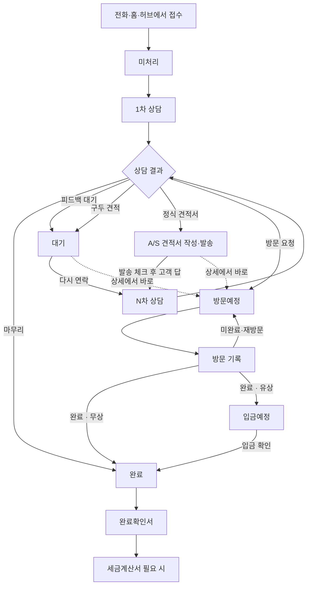

# 고객지원팀 A/S 전체 흐름

접수된 현장을 놓치지 않고, 전화 → 견적 → 방문 → 수금 → 완료확인서까지 이어서 챙긴다.
셔터견적기는 영업부 전용이며 이 흐름에 넣지 않는다.

## 한눈에

현장에서 보는 상태

| 화면 | 뜻 | 다음에 할 일 |
|------|----|--------------|
| 미처리 | 접수만 됨. 1차 상담 전 | 전화 · 1차 상담 |
| 대기 | 피드백 / 구두 견적 / 정식 견적 | 다시 상담, 견적 발송, 또는 방문일 |
| 방문예정 | 날짜·팀·시간이 잡힘 | 가서 방문 기록 |
| 입금예정 | 유상 완료, 돈 안 들어옴 | 입금 확인 |
| 완료 | 전화로 끝났거나 현장 완료(무상, 또는 유상+입금) | 완료확인서 · 세금계산서 |

## 어디서 보나

**홈 고객지원팀 (오늘)**  
오늘 접수 · 오늘 방문 · 수금 · 견적 미발송. **고객 대기**는 피드백 · 구두 견적 · 발송 후. 아래 **오늘 조치** 줄에서 상담 / 방문 기록 / 견적서 / 입금 확인 / 전화.

**홈 달력**  
영업부 / 고객지원팀 / 자동문의고수. 고객지원은 방문예정 · 수금예정.

**고객지원 허브**  
접수(미처리) → 대기 → 방문 → 수금 → 현장.  
도구: 새 접수, 방문 달력(주간표), 방문 팀, 지도, 단가표, A/S 견적서, 세금계산서, 완료확인서.

---

## 1. 접수

홈 접수 또는 **고객지원팀 → 새 접수**.

1. 이름 · 전화 · 주소 · 증상 · 긴급도 · 사진.
2. 이름 넣으면 명함에서 전화·이메일을 채운다.
3. 저장하면 **미처리**. 바로 상세로 가서 1차 상담.

주소가 있으면 현장 지도에 찍힌다.

---

## 2. 전화 상담

미처리 상세에서 **1차 상담**. 내용 + 결과 하나.

| 결과 | 다음 | 할 일 |
|------|------|--------|
| 마무리 | 완료 | 전화로 끝. 방문 없음 |
| 피드백 대기 | 대기 | 안내하고 해보게 함. 다시 오면 N차 상담 |
| 구두 견적 | 대기 | 말로 금액. 이어서 정식 견적서를 보내거나, 다시 오면 방문일 |
| 정식 견적서 | 대기 | A/S 견적서 작성 · 발송 · 발송 체크 |
| 방문 요청 | 방문예정 | 주간표/피커에서 빈 날짜·팀·시간 |

상세 하단은 **지금 할 일**이다. 대기 중이면 상담을 다시 열지 않고 **방문일 잡기**를 할 수 있다.

---

## 3. 견적 (A/S 전용)

구두 견적은 일단 말로 금액만 남긴다. 그 다음에도 상세 **견적서**로 정식 견적서를 작성·발송할 수 있다. 보내면 대기 상태가 정식 견적 쪽으로 이어진다.

정식 견적서:

1. 상세 **견적서** 또는 상담에서 작성. 단가표에서 부품·인건비를 넣는다.
2. 이미지 / PDF / 이메일로 보낸다.
3. **발송 체크**(오늘 / 예정일 / 다른 날). 홈 **견적 미발송**이 꺼진다.
4. 고객이 답하면 N차 상담이거나, 바로 방문일을 잡는다.

셔터견적기와 섞지 않는다.

---

## 4. 방문 일정

**방문 달력** 기본은 주간표(팀 × 09:00~17:00).

- 빈 칸 → 미완료 현장 고르기
- 채워진 칸 → 상세 / 일정 변경 / 방문 기록
- 같은 팀·날짜·시간은 막힌다
- 월간으로 바꾸면 방문 · 견적 발송 · 입금이 같이 보인다

홈 달력 고객지원 **방문예정**과 같은 건이다.

---

## 5. 방문 기록

방문일 당일(또는 지난 방문) 상세에서 **방문 기록**.

1. 내용 · 사진.
2. **완료** 또는 **미완료 · 재방문**.
3. 미완료면 다음 방문일·팀·시간 → 방문예정 유지.
4. 완료 · **무상** → 완료.
5. 완료 · **유상** → 금액 + 입금예정일(+ 당일 입금이면 입금일) → **입금예정**.

---

## 6. 수금

유상 완료만 여기로 온다. 무상은 수금이 없다.

볼 곳:

- 홈 고객지원 **수금** 칸 · 오늘 조치 **입금 확인**
- 홈 달력 **수금예정**
- 허브 **오늘 입금 / 지난 입금**
- **수금관리** (예정 · 지난 · 입금완료)

할 일:

1. 입금되면 체크(오늘 / 예정일 / 다른 날).
2. 입금이 끝나야 그 건 수금이 끝난다. 접수는 **완료**.
3. 세금계산서가 필요하면 **세금계산서**에서 지사별 발행 요청.

입금이 안 끝나면 완료확인서를 써도 수금은 남아 있다.

---

## 7. A/S 완료확인서

현장 작업이 끝났을 때 남긴다. 허브 **완료확인서**, 또는 현장검색에서 그 현장으로.

넣을 내용:

1. 현장 · 담당자
2. 금액 · 입금예정일 (유상이면)
3. 고객 사인
4. 투입 자재

그다음 버튼: **수금** / **세금계산서**.

무상이면 금액·수금 없이 확인서만 남긴다. 유상이면 확인서와 수금을 같이 본다.

지금 앱에서는 화면과 항목은 있고, **사인 저장·PDF는 다음 작업**이다. 수금 체크와 세금계산서 요청은 이미 된다.

---

## 한 현장이 끝나는 두 갈래

**전화로 끝**  
접수 → 1차 상담 마무리 → 완료. 방문·수금·확인서 없음.

**현장에 감**  
접수 → 상담(필요하면 견적) → 방문일 → 방문 기록  
→ 무상: 완료 → 완료확인서  
→ 유상: 입금예정 → 입금 확인 → 완료 → 완료확인서 → 세금계산서

같은 현장은 **현장 검색**에서 이전 접수·견적을 이어서 본다.

---

## 놓치면 안 되는 것

1. 미처리 — 접수만 되고 1차 상담 없음
2. 피드백·구두 견적 — 고객이 다시 안 옴
3. 정식 견적 발송일 — 보내기로 한 날 미발송
4. 방문일 — 오늘·지난 방문 미기록
5. 입금예정일 — 유상 완료 후 미입금
6. 완료확인서 — 현장 끝났는데 확인서를 안 남김

로컬 알림은 오늘·지난 방문/발송/입금이 있으면 9·13·18시.
