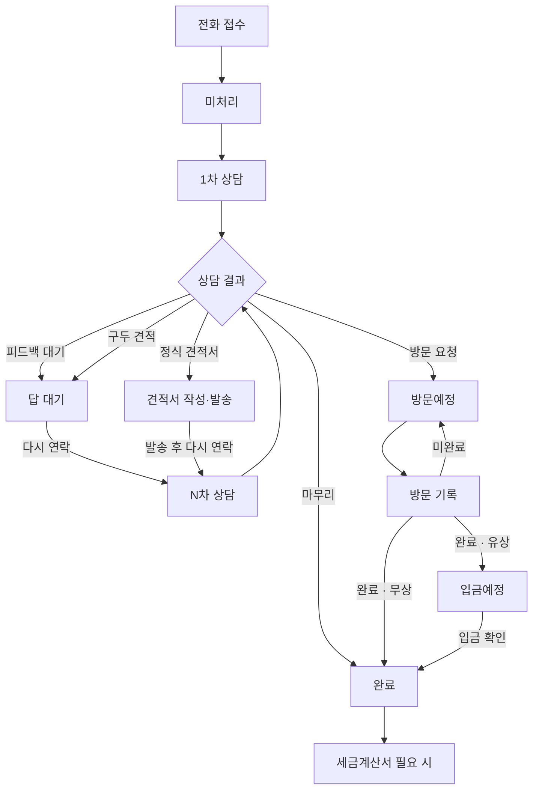

# 고객지원팀 A/S 전체 흐름

접수를 놓치지 않고, 상담 → 방문 → 수금까지 이어서 챙기는 업무 기준.
앱 화면·상태 값은 현재 `ios` 브랜치 구현과 같다.

## 한눈에



## 상태

| 화면 | DB `service_status_id` | 뜻 |
|------|------------------------|----|
| 미처리 | `null` 또는 `4` | 접수됨. 1차 상담 전 |
| 답 대기·견적서 | `2` | 피드백 대기 / 구두 견적 / 정식 견적서 |
| 방문예정 | `5` | 방문일이 잡힘. 방문 기록 필요 |
| 완료 | `1` | 전화 마무리 또는 현장 방문 완료 |

- **전체 미처리** = 미처리만 (1차 상담 전)
- **전체 미완료** = 완료(`1`)가 아닌 모든 건

## 1. 접수

메뉴 **고객지원팀 → 새 접수** (또는 홈 접수에서 A/S).

1. 이름·전화·주소·증상·긴급도·사진을 남긴다.
2. 이름 입력 시 명함에서 찾아 전화·이메일을 채운다. 전화가 여러 개면 고른다.
3. 저장하면 **미처리**가 되고, 바로 상세로 가서 1차 상담을 남긴다.

주소가 있으면 **현장 지도**에 찍힌다. 가까운 미처리도 같이 본다.

## 2. 1차 상담 (전화)

미처리 상세에서 **1차 상담**. 내용 + 결과 하나를 고른다.

| 결과 | 다음 상태 | 다음에 할 일 |
|------|-----------|--------------|
| 마무리 | 완료 | 끝. 방문 기록 없음 |
| 피드백 대기 | 답 대기 | 전화로 이것저것 안내하고 해보게 함. 다시 연락 오면 N차 상담 |
| 구두 견적 | 답 대기 | 말로 금액 전달. 다시 전화 오면 방문일을 잡음 |
| 정식 견적서 | 답 대기 | 보낼 날을 정함. 견적서 작성 → 이미지/PDF/이메일 → 발송 체크 |
| 방문 요청 | 방문예정 | 방문일을 잡음. 그날 다녀온 뒤 방문 기록 |

방문 기록 버튼은 **방문 요청으로 날짜가 잡힌 뒤**에만 나온다. 1차 상담 전에는 필요 없다.

## 3. 답 대기 · 견적서

허브 **답 대기·견적서**. 고객 연락 또는 견적 발송을 챙긴다.

- **피드백 대기:** 다시 오면 마무리 / 방문 / 견적
- **구두 견적:** 다시 오면 방문일을 잡고 방문
- **정식 견적서:** 작성·저장·이메일. 달력 발송예정일에 **오늘 / 예정일 / 다른 날**로 발송 체크. 받은 뒤 방문 요청이면 방문일

견적서는 고객지원팀 전용 양식이다. 영업 셔터 견적기와 별개.

## 4. 방문

허브 **금일 방문예정 / 지난 방문예정**, 홈 **금일 방문**, **방문·발송 달력**.

1. 방문일 당일 현장에 간다.
2. **방문 기록:** 내용, 완료/미완료, 유상/무상.
3. 미완료면 **다음 방문일**을 다시 잡는다 → 방문예정 유지.
4. 완료·무상이면 **완료**.
5. 완료·유상이면 금액 + **입금예정일** → 수금으로 넘어간다.

## 5. 수금 · 세금계산서

- 허브 **오늘 입금 / 지난 입금**, **수금관리**.
- 입금되면 체크. 입금이 끝나야 그 건 수금이 끝난다.
- 세금계산서가 필요하면 **세금계산서**에서 지사별 발행 요청.

## 화면에서 어디를 보나

### 홈 고객지원팀

| 칸 | 동작 |
|----|------|
| 금일 A/S (금주·금월) | 아래에서 지사 선택(전체 포함) → 그 기간 접수 |
| 금일 미처리 | 지사 선택 → 1차 상담 전 |
| 금일 방문 | 지사 선택 → 방문 달력 |
| 전체 미처리 | 지사 선택 → 날짜 무관 1차 상담 전 |
| 전체 미완료 | 마무리·방문 완료가 아닌 모든 건 |

지사: **전체 · 본사 · 대구 · 대전 · 전남 · 기타** (주소 기준).

### 고객지원팀 허브

지금 할 일: 전체 미처리, 전체 미완료, 금일 미처리, 답 대기·견적서, 금일/지난 방문, 오늘/지난 입금.

그다음: 새 접수, 접수내역, 현장 지도, 방문·발송 달력, A/S 단가표, 견적서, 수금, 세금계산서.

### A/S 단가표

고객지원팀 허브·접수내역·접수 상세·N차 상담에서 연다. 2026.03.06 통합 단가표(WMS·SPD·OHD 부품 175종, 인건비 58종, 작성 남현우 팀장). 제품군 필터·품명/영문/금액 검색, 부품 사진·도해, 추가·수정·삭제, 누가 어떻게 바꿨는지 이력이 남는다. 사이즈 표준단가와 별개.

### 아직 골격만 있는 화면

현장검색, 완료확인서, 교육 FAQ.

## 놓치면 안 되는 것

1. **미처리** — 접수만 되고 1차 상담이 없음
2. **피드백 대기·구두 견적** — 고객이 다시 안 옴
3. **정식 견적서 발송일** — 보내기로 한 날 미발송
4. **방문일** — 오늘·지난 방문 미기록
5. **입금예정일** — 유상 완료 후 미입금

로컬 알림은 오늘·지난 방문/발송/입금이 있으면 9·13·18시에 맞춘다.

## 관련 코드

| 항목 | 위치 |
|------|------|
| 상태·상담 결과·다음 할 일 | `lib/data/support_call_log_repository.dart` |
| 허브 건수 | `lib/features/customer_support/support_due_schedule.dart` |
| 1차·N차 상담 | `support_first_consultation_sheet.dart` |
| 방문 기록 | `lib/data/support_visit_report.dart` |
| 견적서 | `support_quote_writer_screen.dart` |
| A/S 단가표 | `support_unit_price.dart`, `lib/data/support_unit_price_repository.dart` |
| 홈 지사 선택 | `lib/features/home/home_hub_screen.dart` |

```bash
flutter test test/support_call_log_stats_test.dart test/support_visit_report_test.dart test/support_quote_document_test.dart test/support_unit_price_test.dart
```
